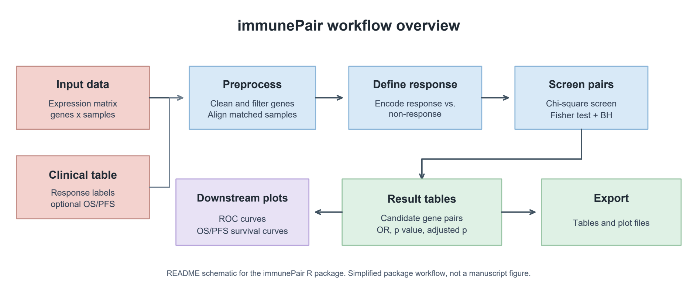

# immunePair

`immunePair` is an R package for pairwise gene marker analysis in immune
response studies. It screens gene pairs using pairwise expression comparisons,
chi-square testing, Fisher's exact test, and multiple-testing correction.

The package is designed for expression matrices with matched clinical response
annotations, such as responder and non-responder groups in immunotherapy or
other immune response studies. Instead of testing each gene independently, it
tests whether the relative expression order between two genes is associated
with response status.



Editable workflow PDF: [immunePair-workflow-editable.pdf](man/figures/immunePair-workflow-editable.pdf)

## Installation

You can install the development version from GitHub:

```r
install.packages("remotes")
remotes::install_github("twl-00/immunePair", upgrade = "never")
```

## Quick Start

```r
library(immunePair)

expr_file <- system.file(
  "extdata",
  "example_exp.txt",
  package = "immunePair"
)

clinical_file <- system.file(
  "extdata",
  "example_clinical.txt",
  package = "immunePair"
)

result <- run_pair_marker_analysis(
  expr_file = expr_file,
  clinical_file = clinical_file,
  out_dir = tempdir(),
  response_col = "response",
  response_label = "response",
  main_delta = 0.25,
  delta_list = c(0, 0.25, 0.5),
  dataset_name = "example"
)

result$sensitivity
head(result$pairs)
head(result$sig_pairs)
```

Basic downstream plots can be generated directly from the result object:

```r
plot_pair_roc(result, gene1 = "GENE_A", gene2 = "GENE_B")
```

The bundled example data include a small amount of overlap between response and
non-response samples so that the ROC curve is illustrative rather than
perfectly separated.

If the clinical table contains survival time and event columns, a Kaplan-Meier
curve can also be drawn for a selected gene pair:

```r
plot_pair_survival(
  result,
  gene1 = "GENE_A",
  gene2 = "GENE_B",
  time_col = "OS_time",
  event_col = "OS_status"
)

plot_pair_survival(
  result,
  gene1 = "GENE_A",
  gene2 = "GENE_B",
  time_col = "PFS_time",
  event_col = "PFS_status"
)
```

## Method Overview

`immunePair` uses the following workflow:

1. Read an expression matrix and a clinical annotation table.
2. Remove duplicated or missing gene names.
3. Filter genes by the proportion of samples with non-zero expression.
4. Match samples between the expression matrix and clinical table.
5. Convert the selected response label to a binary response vector, where
   `response_label` is coded as 1 and all other labels are coded as 0.
6. Apply `log2(expression + 1)` transformation internally.
7. For each gene pair, compare the two genes within each sample. If the
   expression difference is larger than `delta`, the pair is assigned to one of
   two relative-expression states.
8. Use a chi-square test as a fast screening step.
9. Apply Fisher's exact test to screened pairs.
10. Adjust Fisher p-values using Benjamini-Hochberg correction.

In this context, a significant gene pair means that the relative expression
pattern between the two genes differs between the response and non-response
groups.

## Input Files

The expression file should be a tab-delimited text file. The first column should
contain gene names, and the remaining columns should contain samples.

```text
gene    S1    S2    S3
GENE_A  12    11    10
GENE_B  2     1     2
```

The clinical file should be a tab-delimited text file. The first column should
contain sample IDs, and one column should contain the response label.

```text
sample  response      OS_time  OS_status  PFS_time  PFS_status
S1      response      36       0          18        0
S2      non_response  12       1          5         1
```

Sample IDs in the clinical file should match sample names in the expression
matrix.

Important input requirements:

- Rows of the expression file represent genes and columns represent samples.
- Expression values should be numeric raw or normalized expression values. The
  package applies `log2(expression + 1)` internally before pairwise comparison.
- Duplicated gene names are removed, keeping the first occurrence.
- Genes with too many zero-expression samples are removed according to
  `min_nonzero_prop`.
- Genes with missing expression values after filtering are removed.
- The first column of the clinical file is used as sample IDs.
- The value supplied to `response_label` must appear in the `response_col`
  column.
- Survival columns are optional. If provided, time columns such as `OS_time` or
  `PFS_time` should be numeric, and event columns such as `OS_status` or
  `PFS_status` should use 1 for event and 0 for censored.

## Parameters

Common parameters in `run_pair_marker_analysis()`:

| Parameter | Description | Default |
| --- | --- | --- |
| `expr_file` | Path to the tab-delimited expression matrix. | Required |
| `clinical_file` | Path to the tab-delimited clinical annotation file. | Required |
| `out_dir` | Output directory. If `NULL`, result files are not written. | `NULL` |
| `gene_col` | Gene-name column in the expression file. If `NULL`, the package detects common names such as `gene`, `Gene`, or uses the first column. | `NULL` |
| `response_col` | Clinical column containing response labels. | `"response"` |
| `response_label` | Label treated as the response group and coded as 1. | `"response"` |
| `main_delta` | Delta cutoff used in the main pairwise analysis. Larger values require a stronger expression difference between two genes. | `0.25` |
| `delta_list` | Delta cutoffs used for sensitivity analysis. | `c(0, 0.25, 0.5)` |
| `dataset_name` | Prefix used for written output file names. | Expression file name |
| `sig_cutoff` | Adjusted p-value cutoff for significant gene pairs. | `0.05` |
| `min_nonzero_prop` | Minimum proportion of samples with expression greater than zero for keeping a gene. | `0.5` |
| `min_prop` | Minimum proportion allowed for one relative-expression state in a gene pair. | `0.05` |
| `max_prop` | Maximum proportion allowed for one relative-expression state in a gene pair. | `0.95` |
| `chisq_cutoff` | Chi-square p-value cutoff used for screening. | `0.01` |
| `min_valid_prop` | Minimum proportion of samples with a valid pairwise comparison for a gene pair. | `0.5` |

## Main Output

`run_pair_marker_analysis()` returns a list containing:

- `expr`: filtered and sample-aligned expression matrix
- `clinical`: sample-aligned clinical annotation table
- `response`: binary response vector used in the analysis
- `sensitivity`: number of gene pairs passing chi-square screening under each
  delta cutoff
- `pairs`: all screened gene pairs with chi-square p-values, Fisher p-values,
  odds ratios, and adjusted p-values
- `sig_pairs`: significant gene pairs after adjusted p-value filtering
- `output_paths`: paths of written result files

The `pairs` and `sig_pairs` tables contain these main columns:

| Column | Description |
| --- | --- |
| `gene1`, `gene2` | Gene pair tested. |
| `nr0`, `nr1` | Counts of non-response samples in relative-expression state 0 or 1. |
| `r0`, `r1` | Counts of response samples in relative-expression state 0 or 1. |
| `chisq_p` | Chi-square p-value used in the screening step. |
| `OR` | Odds ratio from Fisher's exact test. |
| `fisher_p` | Fisher's exact test p-value. |
| `adjusted_p` | Benjamini-Hochberg adjusted Fisher p-value. |

When `out_dir` is provided, the workflow writes:

- `<dataset_name>_delta_sensitivity_summary.txt`
- `<dataset_name>_chisq_fisher_bh.txt`
- `<dataset_name>_sig_pairs_adjP<sig_cutoff>.txt`, if significant pairs are
  found

## Downstream Plots

`immunePair` provides base R plotting functions for quick downstream
inspection:

- `plot_pair_roc()`: ROC curve for one or more gene pairs, using the continuous
  expression difference `gene1 - gene2` by default
- `plot_pair_survival()`: Kaplan-Meier curve when survival time and event
  columns are available

Both plotting functions draw to the active graphics device by default. To save
a plot directly, provide a file path:

```r
plot_pair_roc(
  result,
  gene1 = "GENE_A",
  gene2 = "GENE_B",
  file = "pair_roc.pdf"
)
plot_pair_survival(
  result,
  gene1 = "GENE_A",
  gene2 = "GENE_B",
  time_col = "OS_time",
  event_col = "OS_status",
  file = "pair_os_survival.pdf"
)
```

The main screening step uses binary pairwise expression states, such as
`gene1 > gene2` or `gene1 < gene2`, because relative ordering is robust and easy
to compare across samples. ROC analysis uses the continuous expression
difference `gene1 - gene2` by default, after the internal `log2(expression + 1)`
transformation, because ROC curves require ranking information across samples.
A positive score means that `gene1` is higher than `gene2`, and a larger score
means a stronger relative expression difference.

## Result Interpretation

Each gene pair is converted into a relative-expression comparison within each
sample. For example, state 1 means that `gene1` is higher than `gene2` by more
than the selected delta cutoff, while state 0 means that `gene1` is lower than
`gene2` by more than the cutoff. Samples with smaller differences are excluded
from that pairwise comparison.

A significant adjusted p-value indicates that the distribution of the two
relative-expression states is different between response and non-response
samples. Such pairs may be candidate pairwise markers for immune response, but
they should be validated in independent datasets before being treated as robust
biomarkers.

## Citation

If you use `immunePair` in your research, please cite the GitHub
repository:

```text
https://github.com/twl-00/immunePair
```

## License

This package is licensed under the MIT License.
